[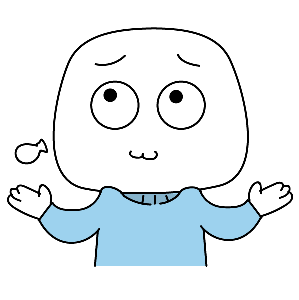](sticker_beneran_nonton_ga.png)
[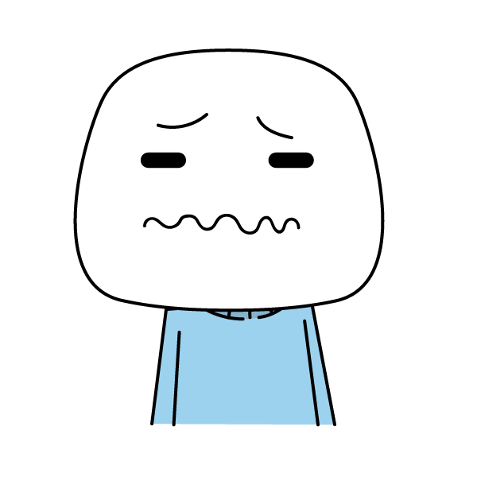](sticker_bohong_nanggung.png)
[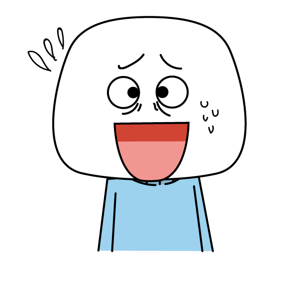](sticker_capek_bohong.png)
[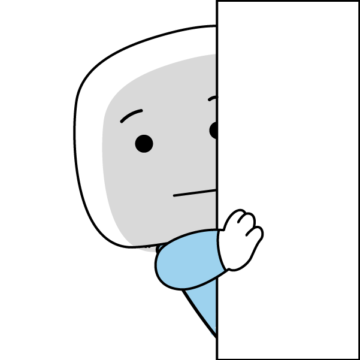](sticker_cowok_ati_ati.png)
[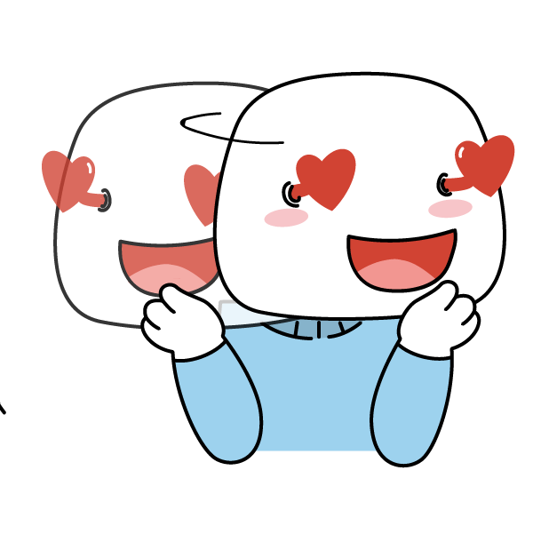](sticker_cowok_bakat_selingkuh.png)
[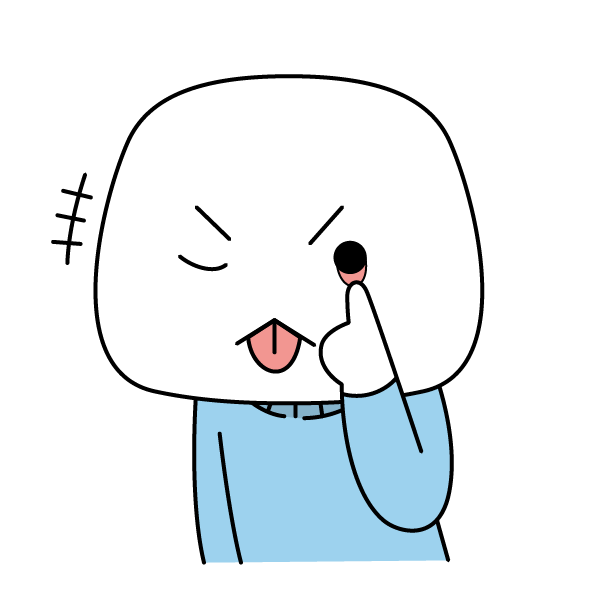](sticker_cowok_berprasangka.png)

[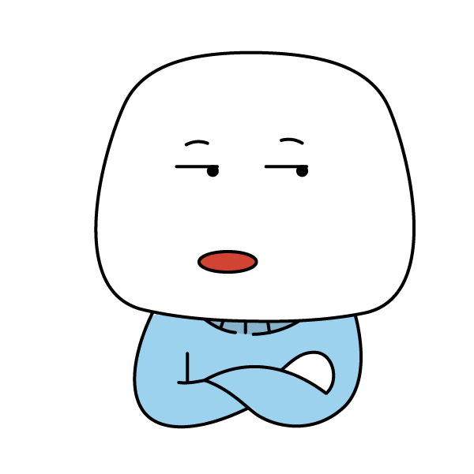](sticker_cowok_ga_percaya.png)

[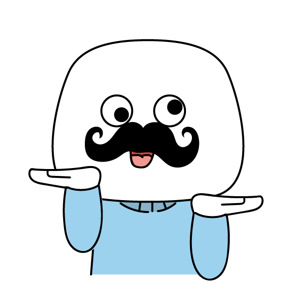](sticker_cowok_kebanyakan_bercanda.png)
[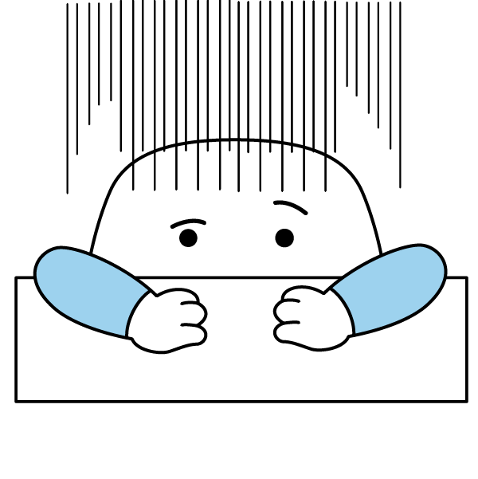](sticker_cowok_keceplosan.png)

[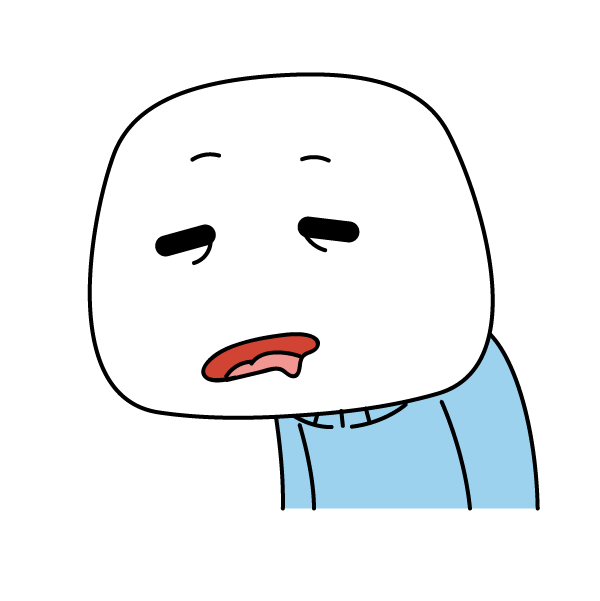](sticker_cowok_pemalas.png)
[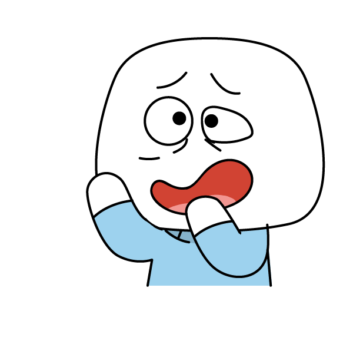](sticker_cowok_pembohong.png)
[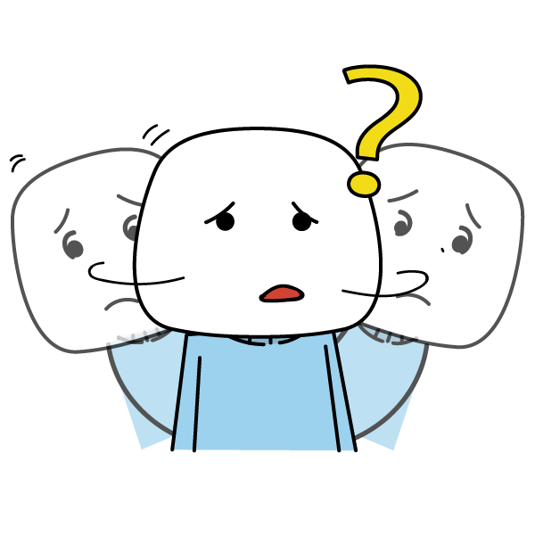](sticker_cowok_plin_plan.png)

[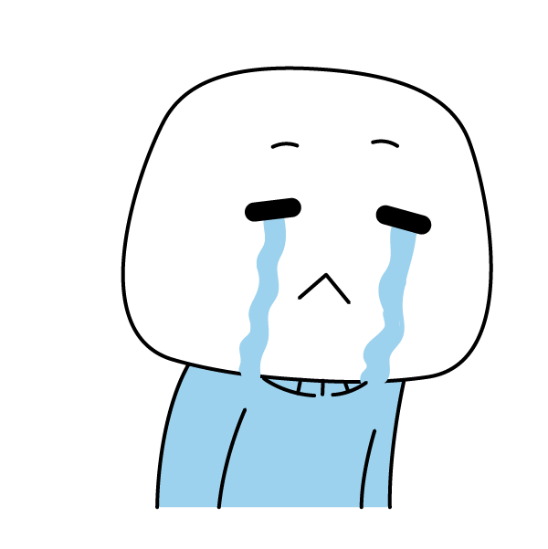](sticker_gagal_bohong.png)

[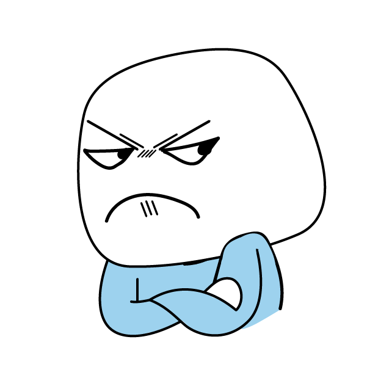](sticker_jadi_marahan_deh.png)
[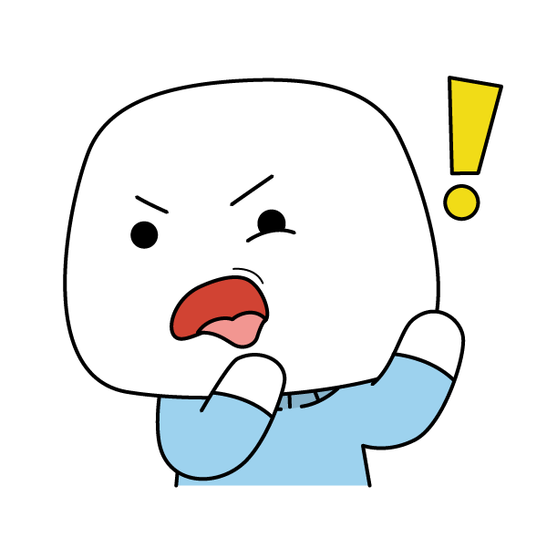](sticker_kok_jadi_ini.png)
[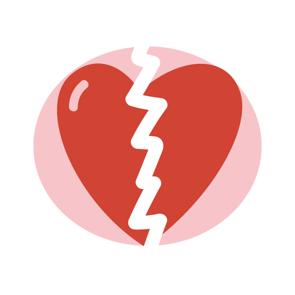](sticker_percaya_setengah_setengah.png)
[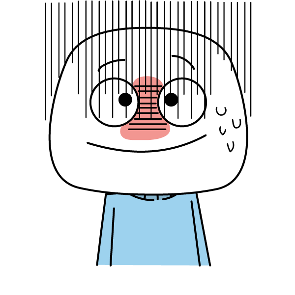](sticker_salah_jawab.png)
[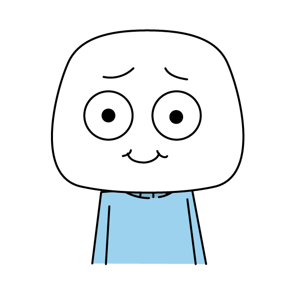](sticker_salah_langkah.png)
[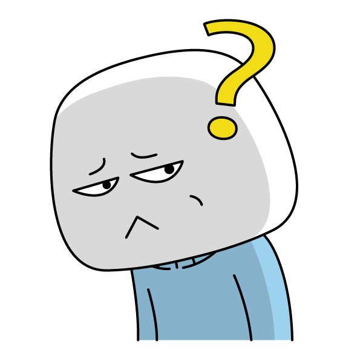](sticker_siapa_sih_dia.png)
[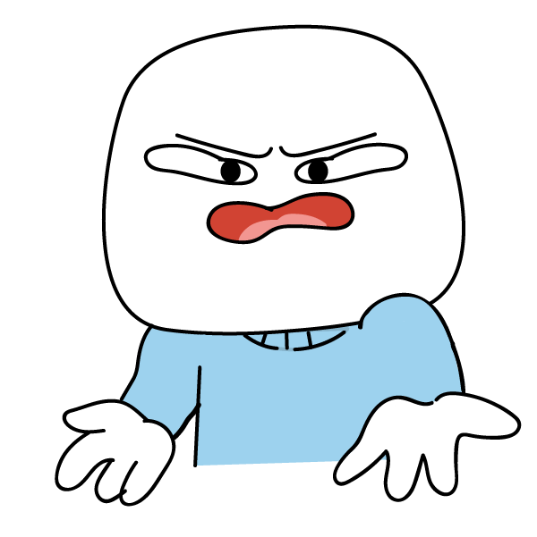](sticker_siapa_yang_salah.png)
[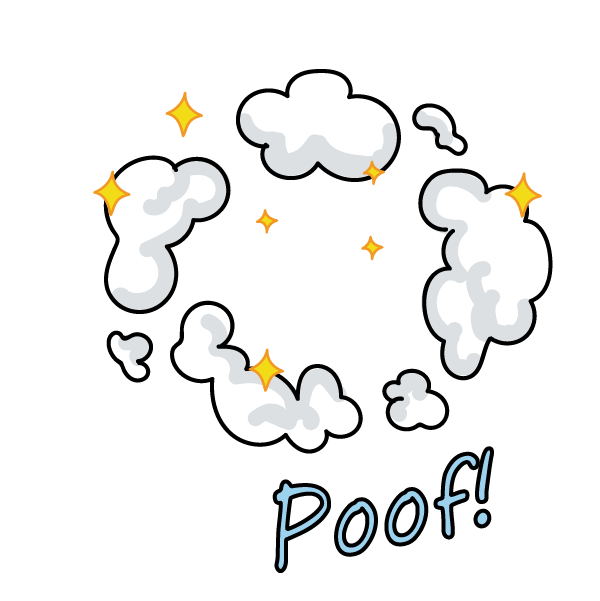](sticker_taki_dan_mitsuha.png)

[<< Balik](https://williamsp.github.io/salahsambung)
